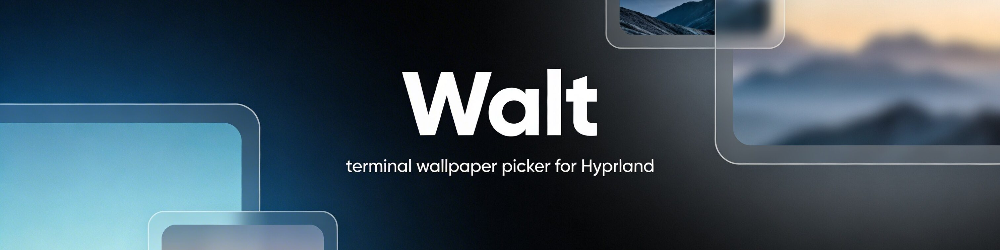
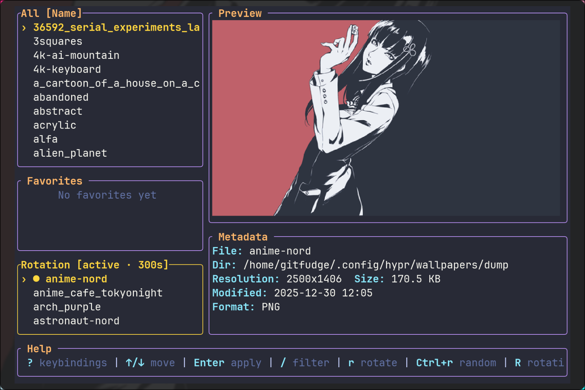

# Walt

Walt is a fast terminal wallpaper picker for Hyprland. Browse your library, preview wallpapers in place, switch themes, and apply a new background without leaving the keyboard.





## Why Walt

- Stay in the terminal while browsing and applying wallpapers
- Preview wallpapers before committing to them
- Keep large wallpaper directories manageable with fast navigation and random selection
- Match the app to your setup with built-in themes, including a `System` theme that follows your terminal
- Use it comfortably on multi-monitor Hyprland setups through `hyprpaper`

## Install

Quick install:

```bash
curl -fsSL https://raw.githubusercontent.com/gitfudge0/walt/main/install.sh | bash
```

This installs `walt` to `~/.local/bin/walt`.

From a local checkout:

```bash
./install.sh
```

Manual install:

```bash
cargo build --release
install -Dm755 target/release/walt ~/.local/bin/
```

## Requirements

- `rust` and `cargo`
- `hyprpaper`
- `hyprctl`
- a terminal with image protocol support
  - Ghostty
  - Kitty
  - WezTerm
  - iTerm2

## Hyprland setup

For Ghostty:

```conf
bind = $mainMod SHIFT, D, exec, ghostty --class=walt -e ~/.local/bin/walt
bind = $mainMod, D, exec, ~/.local/bin/walt random
windowrulev2 = float, class:^(com\.mitchellh\.ghostty\.walt)$
windowrulev2 = size 900 600, class:^(com\.mitchellh\.ghostty\.walt)$
windowrulev2 = center, class:^(com\.mitchellh\.ghostty\.walt)$
```

`$mainMod + Shift + D` opens the Walt TUI. `$mainMod + D` applies a random wallpaper immediately.

`install.sh` detects your current terminal and prints matching launch instructions for Ghostty, WezTerm, or Kitty, including the random-wallpaper bind.

Make sure `hyprpaper` is running:

```conf
exec-once = hyprpaper
```

## First run

1. Copy the path to your wallpaper directory.
2. Launch Walt.
3. Paste the directory path into the app and press `Enter`.

Walt stores config in `~/.config/walt/` and automatically reads legacy settings from `~/.config/wallpaper-switcher/`.

## Usage

CLI mode:

```bash
walt random
```

This picks one random wallpaper from all configured directories combined and applies it through `hyprpaper`, without opening the TUI.

To enable persistent auto-rotation, install the user service manually:

```bash
walt rotation install
```

Check whether it is running with:

```bash
walt rotation status
```

Example output:

```text
Rotation Service
Status:   running
Loaded:   loaded (~/.config/systemd/user/walt-rotation.service)
Enabled:  enabled
Active:   active
Interval: 300s (5m)
Entries:  12 wallpapers
```

Set the rotation interval from the CLI with:

```bash
walt rotation interval 900
```

Temporarily stop or restart the installed rotation service with:

```bash
walt rotation disable
walt rotation enable
```

Remove the installed service completely with:

```bash
walt rotation uninstall
```

In the wallpaper browser:

- `↑/↓` or `j/k` to move
- `Tab` or `l` to move to the next section
- `Shift+Tab` or `h` to move to the previous section
- `g/G` to jump to the top or bottom
- `Enter` to apply the selected wallpaper
- `/` to filter the active section
- `s` to toggle sorting for the active section between name and modification date
- `f` to add or remove the selected wallpaper from favorites
- `r` to add or remove the selected wallpaper from rotation
- `Ctrl+r` to pick and apply a random wallpaper
- `R` to open the rotation actions popup
- `i` to change the interval used by the installed rotation service
- `p` to manage wallpaper paths
- `t` to open the theme picker
- `?` to open the keybindings popup
- `q` or `Esc` to quit

Walt does not auto-rotate wallpapers on its own while the TUI is open. Rotation only happens if you explicitly install the background service.

In the path manager:

- `↑/↓` or `j/k` to move
- `a` to add a path
- `d` to remove the selected path
- `p`, `q`, or `Esc` to return
- `t` to open the theme picker

In the theme picker:

- `↑/↓` or `j/k` to preview themes
- `Enter` to confirm
- `Esc` or `q` to cancel

## Themes

Included themes:

- `System`
- `Catppuccin Mocha`
- `Tokyo Night`
- `Gruvbox Dark`
- `Dracula`
- `Nord`
- `Solarized Dark`
- `Kanagawa`
- `One Dark`
- `Everforest Dark`
- `Rosé Pine`

`System` uses your terminal defaults. The other themes render with opaque surfaces for a cleaner in-app look.

## Build

```bash
cargo build --release
```

The binary will be available at `target/release/walt`.

## License

MIT
