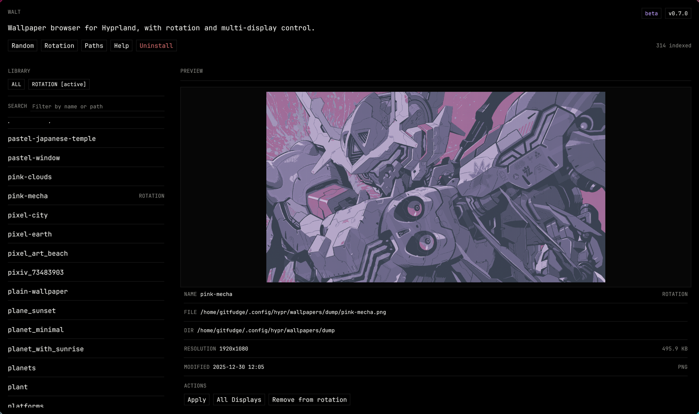

# Walt

Walt is a wallpaper manager for Hyprland with both a terminal UI and a native desktop GUI. It lets you browse, preview, apply, randomize, and rotate wallpapers using `hyprpaper`, while keeping the TUI fast for keyboard-heavy workflows and the GUI focused on preview-driven browsing.


- Browse and apply wallpapers from the terminal or native GUI
- Preview wallpapers before switching
- Manage multi-display wallpaper assignment
- Apply random wallpapers from the app or CLI
- Control a background rotation service
- Manage wallpaper directories and themes

### Get started

Install Walt quickly:

```bash
curl -fsSL https://raw.githubusercontent.com/gitfudge0/walt/main/install.sh | bash
```

> If you're on Arch Linux, you can refer to the [Install](#install) section and use the AUR package.

Start using the app with:

```bash
walt
```

## Choose an Interface

- `walt`
  - keyboard-first terminal workflow
  - in-terminal preview
  - best for fast browsing


- `walt gui`
  - native desktop window
  - larger visual preview
  - better for pointer-driven browsing and dialogs



## Quick Start

### Requirements

- `rust` and `cargo`
- `hyprpaper`
- `hyprctl`
- an image-capable terminal for the TUI preview only:
  - Ghostty
  - Kitty
  - WezTerm
  - iTerm2

### Install

Quick install:

```bash
curl -fsSL https://raw.githubusercontent.com/gitfudge0/walt/main/install.sh | bash
```

If you're on Arch, use your preferred AUR helper:

```sh
yay -S walt-git
```

This installs `walt` to `~/.local/bin/walt`.

From a local checkout:

```bash
./install.sh
```

Manual install:

```bash
cargo build --release
install -Dm755 target/release/walt ~/.local/bin/
```

### First run

1. Launch `walt` for the terminal UI or `walt gui` for the desktop GUI.
2. Paste the path to your wallpaper directory.
3. Press `Enter`.

The GUI folder picker may depend on an XDG desktop portal or native dialog backend on Linux.

Walt stores its config in `~/.config/walt/`. If you have older settings in `~/.config/wallpaper-switcher/`, Walt will read them automatically.

## Hyprland Integration

For Ghostty:

```conf
bind = $mainMod SHIFT, D, exec, ghostty --class=walt -e ~/.local/bin/walt
bind = $mainMod CTRL, D, exec, ~/.local/bin/walt gui
bind = $mainMod, D, exec, ~/.local/bin/walt random
windowrulev2 = float, class:^(com\.mitchellh\.ghostty\.walt)$
windowrulev2 = size 900 600, class:^(com\.mitchellh\.ghostty\.walt)$
windowrulev2 = center, class:^(com\.mitchellh\.ghostty\.walt)$
```

`$mainMod + Shift + D` opens the Walt TUI. `$mainMod + Ctrl + D` opens the GUI. `$mainMod + D` applies a random wallpaper immediately.

`install.sh` detects Ghostty, WezTerm, or Kitty and prints matching launch instructions, including the random-wallpaper bind.

If you want the GUI to float, the `windowrulev2` examples above apply to the GUI window class as well.

Make sure `hyprpaper` is running:

```conf
exec-once = hyprpaper
```

Walt handles legacy `hyprpaper` builds that still expose `preload`, newer builds that apply wallpapers without a preload dispatcher, and active-status implementations where `hyprctl` cannot query active wallpapers by falling back to best-effort in-session indicators.

Debug logs are written to `~/.cache/walt/logs/walt.log` at `info` level by default. Use `WALT_LOG=debug cargo run`, `WALT_LOG=debug cargo run -- gui`, or `WALT_LOG=debug ./target/debug/walt` for verbose tracing, and `tail -f ~/.cache/walt/logs/walt.log` to watch failures live.

## GUI

Walt ships with a native `egui` desktop interface alongside the original TUI. The GUI keeps the same core capabilities as the terminal app:

- wallpaper browsing and large preview
- multi-display apply flows
- random wallpaper actions
- rotation service controls
- wallpaper path management
- uninstall flow

If you do not have a graphical session available, `walt gui` exits with a clear error and you can still use `walt` for the terminal interface.

The GUI folder picker uses your Linux desktop portal or native dialog backend. On Hyprland, install a matching XDG desktop portal backend such as `xdg-desktop-portal-gtk` or `xdg-desktop-portal-kde` if folder selection does not appear.

## CLI Commands

### Launch interfaces

```bash
walt
walt gui
```

- `walt` launches the terminal wallpaper browser
- `walt gui` launches the native desktop GUI

### Random wallpapers

```bash
walt random
walt random --same
walt random 0
```

`walt random` applies different random wallpapers across all detected displays when possible.

`walt random --same` applies one random wallpaper to every display.

`walt random 0` applies one random wallpaper to display `0`. Display indices are zero-based and clamp to the last detected display if the requested index is out of range.

### Rotation service

```bash
walt rotation install
walt rotation status
walt rotation interval 900
walt rotation disable
walt rotation enable
walt rotation uninstall
```

- `install` installs and starts the user service
- `status` shows the current service state
- `interval 900` sets the rotation interval in seconds
- `disable` stops the installed service
- `enable` starts it again
- `uninstall` removes it completely
- while the service is running, newly attached displays are handled automatically

Example `status` output:

```text
Rotation Service
Status:   running
Loaded:   loaded (~/.config/systemd/user/walt-rotation.service)
Enabled:  enabled
Active:   active
Mode:     selected wallpapers
Interval: 300s (5m)
Entries:  12 wallpapers
```

Walt does not auto-rotate wallpapers while the TUI is open unless you install the background service.
When rotate-all mode is enabled from the TUI, `Entries` changes to `all wallpapers`.
The rotation status also shows whether displays rotate with the same wallpaper or different wallpapers per display.
When the rotation service is running, hotplug behavior follows the display mode:

- `same on all displays` mirrors the current wallpaper onto the new display
- `different per display` assigns a fresh random wallpaper to only the new display

### Uninstall

```bash
walt uninstall
```

Prompts before removing the rotation service, config, cache, and installed `~/.local/bin/walt` binary.

For non-interactive use:

```bash
walt uninstall --yes
```

## Keyboard Controls

### Core TUI Controls

Walt opens with the current wallpaper selected in the `All` list when it is already indexed.

- `↑/↓` or `j/k` move
- `Tab` or `l` switch between `All` and `Rotation`
- `Shift+Tab` or `h` switch to the previous section
- `g/G` jump to the top or bottom
- `Enter` apply the selected wallpaper directly when one display is detected, or open a display picker when multiple displays are detected
- `A` apply the selected wallpaper to all displays
- `/` filter the active section
- `s` toggle sort for the active section between name and modification date
- `r` add or remove the selected wallpaper from the manual rotation list
- `Ctrl+r` apply a random wallpaper directly when one display is detected, or open random options when multiple displays are detected
- `R` open the rotation options for service actions, wallpaper scope, and display mode
- `All displays` in the display picker applies the selected wallpaper to every display from inside the popup
- `i` change the interval used by the installed rotation service
- `p` manage wallpaper paths
- `t` open the theme picker
- `?` open the keybindings popup
- `q` or `Esc` quit

`walt rotation enable` and `walt rotation disable` still control only the background service. The rotate-all toggle and the same/different display rotation mode are available only from the `R` popup.

### Popup Controls

The TUI uses focused popups for display selection, random options, rotation controls, path management, and theme selection.

### Display picker

- Appears after `Enter` when multiple displays are detected
- Lists each detected display plus `All displays`
- `↑/↓` or `j/k` move
- `Enter` apply
- `Esc` or `q` close

### Random options

- Appears after `Ctrl+r` when multiple displays are detected
- Offers:
  - `Different on all displays`
  - `Same on all displays`
  - one random target per display, shown as `Display N: <name>`
- Display indices in the popup match the CLI `walt random N` numbering
- `↑/↓` or `j/k` move
- `Enter` apply
- `Esc` or `q` close

### Rotation options

- Open with `R`
- Lets you install or enable the service, switch between selected wallpapers and all wallpapers, choose same-on-all-displays or different-per-display rotation, and change the interval
- `↑/↓` or `j/k` move
- `Enter` run the selected action
- `Esc` close

### Path manager

- `↑/↓` or `j/k` move
- `a` add a path
- `d` remove the selected path
- `p`, `q`, or `Esc` return
- `t` open the theme picker

### Path adding

- Type a path manually
- `Tab` completes from the suggestions list
- `Enter` add the selected path
- `Esc` cancels only when this flow was opened from the path manager

### Theme picker

- `↑/↓` or `j/k` preview themes
- `Enter` confirm
- `Esc` or `q` cancel

## Themes

Walt includes these themes:

- `System`
- `Catppuccin Mocha`
- `Tokyo Night`
- `Gruvbox Dark`
- `Dracula`
- `Nord`
- `Solarized Dark`
- `Kanagawa`
- `One Dark`
- `Everforest Dark`
- `Rosé Pine`

`System` uses your terminal defaults. The named themes use opaque surfaces for a cleaner in-app look.

## Build

```bash
cargo build --release
```

The binary will be available at `target/release/walt`.

## License

MIT
